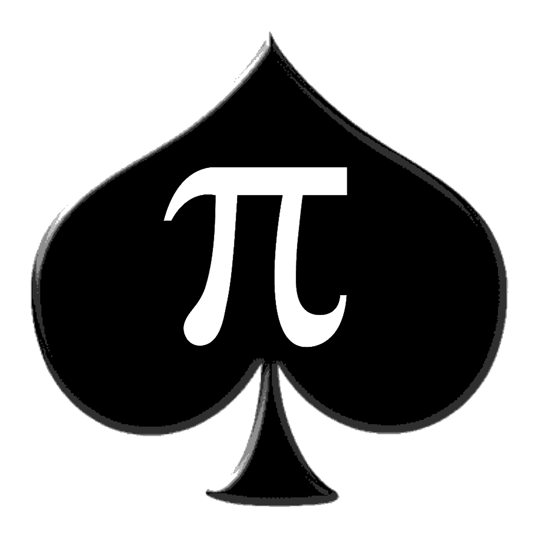

# Fijas y picas

 

It consists of trying to guess a number in the least amount of tries. In each attempt, the player says 4 digits (not repeated) and the opponent gives clues as to how many correct guesses he got, without indicating which ones, as follows:
> If any digit that the player says is within the number to be guessed, but is not in the correct position, it is called a **PICA**. If the digit is in the correct position, it is called **FIJA**. so, the clues will be the number of **PICAS** and the number of **FIJAS** you have

## Video explaining

- [Youtube][1]

---

### Authors

1. [Jhair Paris][2]

[1]: <https://www.youtube.com/> "Youtube Video"

[2]: <https://github.com/wcraft-dev/> "Github link"
